# Relatório final — TaskFlow AI (CloudTask AI SaaS)

> Disciplina **Computação em Nuvem** — UNINTER. Projeto executado em **modo local**
> (Docker), com os recursos de nuvem (EKS, RDS, S3, DynamoDB, CDK) estudados como
> **conceito + código versionado**. Preencha os campos `[ ... ]` da identificação.

---

## 1. Identificação

- **Aluno(a):** João Lucas Faria Filho
- **RU / matrícula:** 4994592
- **Disciplina:** Computação em Nuvem — UNINTER
- **Repositório:** https://github.com/JlucasFaria/computacao-em-nuvem-trabalho-final
  (branch `joaoLucas-trabalho-final`)
- **Data:** 04/07/2026

## 2. Resumo do projeto

O **TaskFlow AI** é um mini-SaaS de **gerenciamento de tarefas** construído ao
longo da disciplina. Oferece uma **API REST** (FastAPI, com Swagger interativo)
para CRUD de tarefas, **autenticação por token JWT**, **upload de arquivos** e
registro de **eventos/logs** de auditoria. A stack é **Python + FastAPI +
PostgreSQL**, empacotada em **Docker**, com caminhos de nuvem (Kubernetes/EKS,
ECR, S3, DynamoDB) e **infraestrutura como código (AWS CDK)**. Todo recurso de
nuvem tem um **fallback local**, permitindo rodar o projeto inteiro sem AWS.

## 3. O que foi implementado (por semana)

> Executado e validado em **modo local** (Docker Compose: API + PostgreSQL 16).
> Evidências em `docs/entrega-final/evidencias/`.

| Semana | Entreguei | Evidência (comando / endpoint) |
| --- | --- | --- |
| 1 — FastAPI + Docker | API FastAPI com `/`, `/health`, Swagger; imagem Docker + Compose | `GET /health` → `{"status":"ok"}`; `docker compose up` |
| 2 — PostgreSQL + config | CRUD de tarefas no PostgreSQL; config via `.env`/pydantic-settings; readiness | `GET /health/ready` → `{"status":"ready","db":"ok"}`; `POST/GET/PUT/DELETE /tasks` |
| 3 — S3 + Kind | Upload com backend selecionável (modo **local** validado); **Kubernetes rodando via Kind** (2 réplicas + auto-healing) | `POST /uploads`; `kubectl get pods -n cloudtask` (Anexo D) |
| 4 — ECR + EKS | Script de build/push para ECR e manifests EKS (caminho AWS, como conceito) | `scripts/semana-04-ecr/`; `infra/k8s/aws/` |
| 5 — HPA + DynamoDB | Eventos automáticos em create/update/delete (modo **local** JSON validado); HPA + teste de carga | `GET /events` → `task.created`; `infra/k8s/hpa.yaml` |
| 6 — CDK + entrega | 7 stacks CDK (S3, ECR, VPC, DynamoDB, etc.), auth JWT, docs finais | `POST /auth/login` → JWT; `infra/cdk/` |
| **Extra (meu toque pessoal)** | Rebranding **→ TaskFlow AI** + endpoint **`GET /tasks/stats`** (agregação) + 3 testes | `GET /tasks/stats` → total + contagem por status/prioridade |

**Testes automatizados:** `docker compose exec -T api pytest` → **73 passed**
(70 da base + 3 do endpoint novo).

## 4. Arquitetura

**O que EU subi (modo local):**

```text
              navegador / curl / Swagger (http://localhost:8000)
                                  │  HTTP
                          ┌───────▼────────┐
                          │  API FastAPI   │  (container cloudtask-api)
                          │  + Auth JWT     │
                          │  /tasks /uploads│
                          │  /events /stats │
                          └───┬───────┬─────┘
               uploads (disco)│       │ tarefas (SQL)
                     ./local_ │       ▼
                     uploads  │   ┌────────────┐
              eventos (JSON)  │   │ PostgreSQL │ (container cloudtask-db, vol. pgdata)
              ./local_events ─┘   └────────────┘
```

**Arquitetura-alvo em produção (conceito, coberto no código/CDK):** a mesma API
rodaria em **EKS** (imagem no **ECR**, HPA 2→5), atrás de **ALB + ACM** (HTTPS na
borda), com **RDS** (tarefas), **S3** (uploads) e **DynamoDB** (eventos) — tudo
descrito como código no **AWS CDK** (`infra/cdk/`). Ver `final-architecture.md`.

## 5. Como executar (reprodutível)

```bash
# pré-requisito: Docker Desktop rodando
cp .env.example .env
docker compose up --build -d          # sobe API + PostgreSQL

# healthcheck
curl http://localhost:8000/health          # {"status":"ok"}
curl http://localhost:8000/health/ready     # {"status":"ready","db":"ok"}

# autenticar (rotas de dados exigem token JWT)
TOKEN=$(curl -s -X POST http://localhost:8000/auth/login \
  -H "Content-Type: application/json" \
  -d '{"username":"admin","password":"admin#123"}' | \
  python -c "import sys,json;print(json.load(sys.stdin)['access_token'])")

# usar a API
curl -X POST http://localhost:8000/tasks -H "Authorization: Bearer $TOKEN" \
  -H "Content-Type: application/json" \
  -d '{"title":"Estudar Cloud","priority":"high"}'
curl http://localhost:8000/tasks/stats -H "Authorization: Bearer $TOKEN"

# testes
docker compose exec -T api pytest       # 73 passed

# Swagger interativo: http://localhost:8000/docs
```

## 6. Decisões e trade-offs

- **PostgreSQL como container, não RDS:** sem custo e mais simples para a demo.
  Trade-off: perco backup gerenciado, HA e patch automático que o RDS traria.
- **Modo local para S3 e eventos (fallback):** permite rodar o projeto inteiro
  **sem AWS/credenciais**. Trocar para S3/DynamoDB é só mudar o `.env`.
- **Autenticação JWT no próprio backend:** simplificação didática. Em produção,
  um provedor de identidade dedicado (Cognito/OAuth) centralizaria o login.
- **HTTPS na borda (conceito):** TLS terminaria no ALB/Edge, nunca no app —
  evita loop de redirect nas health probes. Localmente rodo em HTTP puro.
- **Endpoint `/tasks/stats` agrega no banco (COUNT/GROUP BY):** mais eficiente
  que trazer todas as linhas para a memória da API. Declarado **antes** de
  `/tasks/{id}` para o FastAPI não tratar `"stats"` como um id.

## 7. Custos

- **Recursos que cobraram:** **nenhum**. Execução 100% local (Docker na própria
  máquina).
- **Estimativa do período:** **US$ 0,00**.
- **Confirmação de limpeza:** não se aplica — nada foi provisionado na AWS,
  portanto não há recurso cobrável para destruir. Sweep detalhado no
  `deployment-checklist-preenchido.md`.

## 8. LGPD e segurança

- A aplicação coleta **pouquíssimo dado pessoal** (tarefas são texto livre; uma
  única conta administrativa). Dados em PostgreSQL/disco local.
- **Segredos protegidos:** `.env` no `.gitignore` e **não** versionado
  (verificado); **nenhuma chave AWS real** no repositório. A senha `admin#123` é
  credencial de **demo** documentada.
- **Direitos do titular:** acesso via `GET /tasks`, exclusão via `DELETE /tasks`.
- **Em produção real ficaria pendente:** TLS na borda (ACM), criptografia em
  repouso (S3/RDS), segredos no Secrets Manager, roles IAM de menor privilégio.
- Detalhes no `lgpd-checklist-preenchido.md`.

## 9. Dificuldades e aprendizados

- **Autenticação inesperada:** ao rodar, descobri que as rotas de dados agora
  exigem **token JWT** (Semana 6). Aprendi a fazer login e usar o header
  `Authorization: Bearer`. *(Lição: sempre validar o fluxo real antes de assumir.)*
- **Ordem de rotas no FastAPI:** ao criar `/tasks/stats`, entendi que rotas
  específicas precisam vir **antes** das paramétricas (`/tasks/{id}`), senão o
  framework confunde `"stats"` com um id → erro 422.
- **Agregação no banco:** usar `COUNT` + `GROUP BY` em vez de contar em Python.
- **Fallback local:** compreendi na prática o valor de projetar com fallback —
  consegui rodar e demonstrar tudo **sem gastar 1 centavo** na AWS.
- **Cuidado com segredos:** verifiquei de fato (não "no chute") que nada sensível
  foi para o git antes de publicar o repositório.

## 10. Anexos

- [x] `lgpd-checklist-preenchido.md` preenchido
- [x] `deployment-checklist-preenchido.md` (custos/limpeza) preenchido
- [x] Evidências: `evidencias/01-smoke-test-local.md`, `evidencias/02-toque-pessoal.md`
- [x] Prints do Swagger (`http://localhost:8000/docs`) — ver **Anexo C**
- [x] Prints de **Kubernetes funcionando + Containers Docker** — ver **Anexo D**
- [x] Prints de **Nuvem AWS: S3 + Deploy em cloud (EC2)** — ver **Anexo E**


<div style="page-break-before: always;"></div>

# Anexo A — Evidências de execução (Passo 1)

# Evidências — Passo 1: execução local (smoke test)

> Ambiente: Windows 11 + Docker Desktop. Modo **local** (fallback sem AWS):
> `STORAGE_MODE=local`, eventos em JSON. Data: 02/07/2026.

## Como foi subido

```bash
docker compose up --build -d      # sobe API (FastAPI) + PostgreSQL 16
docker compose ps                 # cloudtask-api + cloudtask-db (healthy)
```

## 1. Metadados, liveness e readiness

> **Nota:** este smoke test foi feito no **Passo 1**, **antes** do rebranding.
> Por isso o `GET /` ainda responde `"CloudTask AI SaaS"`. A partir do **Passo 2**
> (ver Anexo B) o nome passou a ser **TaskFlow AI** — como comprova o print da
> home no Anexo C.

```text
GET /              -> {"name":"CloudTask AI SaaS","version":"0.6.0","docs":"/docs"}
GET /health        -> {"status":"ok"}
GET /health/ready  -> {"status":"ready","db":"ok"}      # readiness checou o Postgres
```

## 2. Autenticação (JWT — Semana 6)

```text
POST /auth/login  {"username":"admin","password":"admin#123"}
  -> {"access_token":"eyJhbGciOiJIUzI1NiI...","token_type":"bearer","expires_in":28800}
```

As rotas de dados exigem `Authorization: Bearer <token>` (retornam 401 sem token).

## 3. CRUD de tarefas (Semana 2)

```text
POST /tasks {"title":"Minha primeira tarefa","description":"...","priority":"high"}
  -> 201 {"id":1,"status":"pending","priority":"high", ...}
GET /tasks
  -> [ {"id":1,"title":"Minha primeira tarefa", ...} ]
```

## 4. Upload de arquivo — modo local (Semana 3)

```text
POST /uploads  (multipart, file=@README.md)
  -> {"filename":"2d923ad12998f5a9-ddd81d19.md","url":"/uploads/...","storage_mode":"local"}
```

## 5. Eventos automáticos (Semana 5 / Aula 10)

```text
GET /events
  -> [ {"event_type":"task.created","task_id":1,
        "message":"Tarefa 1 criada: 'Minha primeira tarefa'.", ...} ]
```

O evento `task.created` foi gerado **automaticamente** ao criar a tarefa — integra
CRUD (Aula 3) + eventos (Aula 10).

## 6. Testes automatizados

```bash
docker compose exec -T api pytest
# ......................................................................  [100%]
# 70 passed in 1.89s
```

## Conclusão

Aplicação sobe e funciona **ponta a ponta em modo local**, sem depender da AWS,
conforme o princípio de *fallback local* definido pelo professor em `docs/TAREFAS.md`.
Todos os endpoints das Aulas 1–12 respondem; 70 testes automatizados passam.


<div style="page-break-before: always;"></div>

# Anexo B — Evidências do toque pessoal (Passo 2)

# Evidências — Passo 2: toque pessoal

> Customizações feitas por mim sobre a base, para o projeto não ser cópia
> idêntica e mostrar domínio do código. Data: 02/07/2026.

## 1. Rebranding: CloudTask AI SaaS → **TaskFlow AI**

Alterado o nome visível do serviço no título do Swagger, no endpoint raiz e na
configuração.

Arquivos: `app/main.py` (título FastAPI, endpoint `/`, descrição),
`app/core/config.py` (`app_name`), `tests/test_health.py` (asserção do nome).

```text
GET /  ->  {"name":"TaskFlow AI","version":"0.6.0","docs":"/docs"}
```

O título **TaskFlow AI** aparece no topo do Swagger UI (`/docs`).

## 2. Endpoint novo: GET /tasks/stats (não existia na base)

Retorna um **resumo agregado** das tarefas — total geral + contagem por `status`
e por `priority`. Feito com `COUNT` + `GROUP BY` no PostgreSQL (agregação no banco,
não em Python).

Arquivos: `app/api/routes_tasks.py` (endpoint + query),
`app/db/schemas.py` (schema `TaskStats`), `tests/test_tasks_crud.py` (3 testes).

Detalhe técnico: o endpoint é declarado **antes** de `/tasks/{task_id}` para o
FastAPI não interpretar `"stats"` como um id (evita erro 422).

```text
GET /tasks/stats
  -> {"total":3,
      "by_status":{"pending":1,"in_progress":1,"done":1},
      "by_priority":{"low":1,"medium":0,"high":2}}
```

## 3. Testes

Adicionei 3 testes automatizados para o novo endpoint (`TestStats`):
vazio, contagem por status/prioridade, e a não-colisão com a rota `/{task_id}`.

```bash
docker compose exec -T api pytest
# 73 passed in 2.01s     (70 da base + 3 novos)
```

Toda a suíte continua verde — a customização não quebrou nada da base.


<div style="page-break-before: always;"></div>

# Anexo C — Prints do Swagger (evidência visual)

> Capturas reais da interface Swagger (`http://localhost:8000/docs`) com a API
> **TaskFlow AI** rodando em modo local. Comprovam o funcionamento ponta a ponta:
> home, autenticação JWT, CRUD, o endpoint novo `/tasks/stats` e os eventos.

## C.1 — Página inicial do Swagger

Título **TaskFlow AI** (versão `0.6.0`, OpenAPI 3.1) e a lista de endpoints.

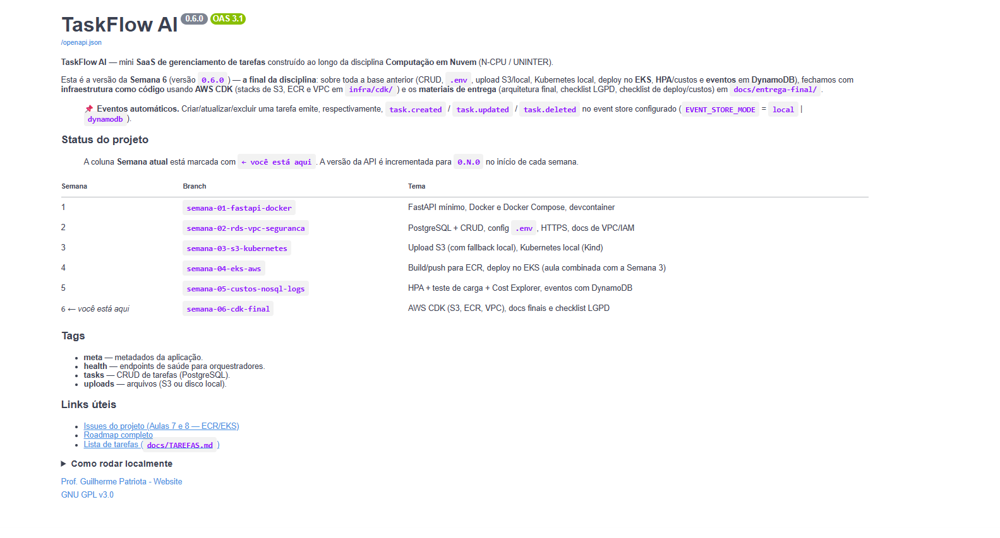

## C.2 — Autenticação JWT (`POST /auth/login`)

Requisição com as credenciais de demo (`admin` / `admin#123`):

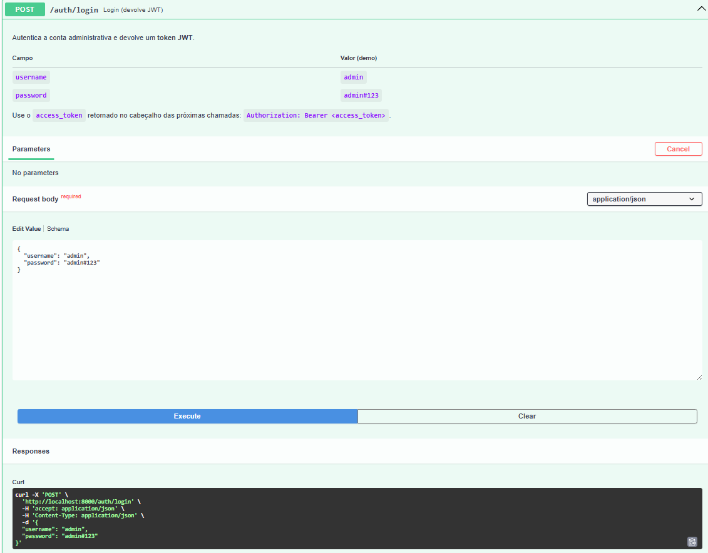

Resposta **200** com o `access_token` (usado no botão *Authorize* do Swagger):

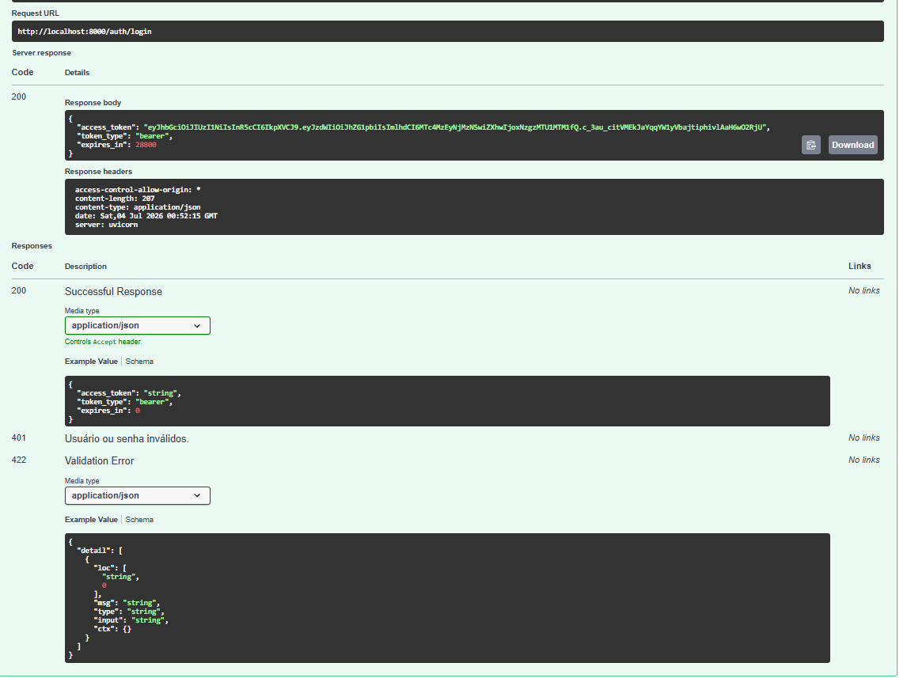

## C.3 — Criar tarefa (`POST /tasks`)

Requisição autenticada (cadeado fechado = rota protegida por token):

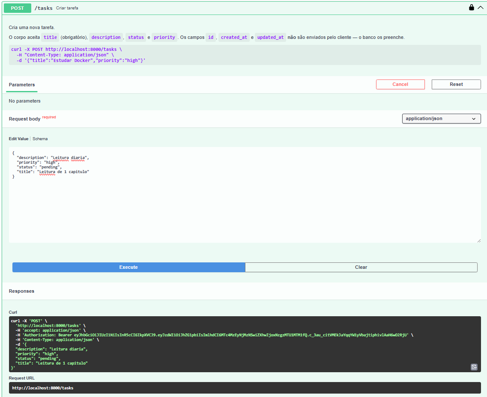

Resposta **201** — tarefa criada, já com `id`, `status` e datas preenchidos:

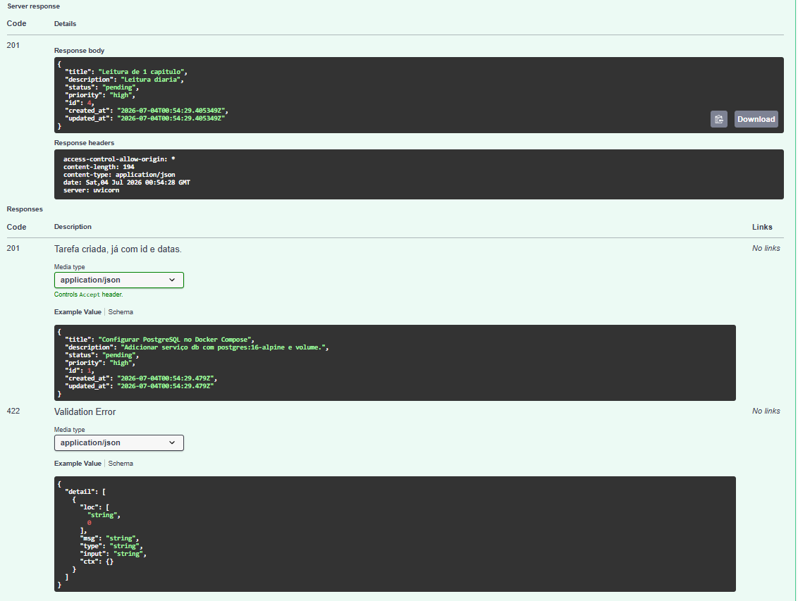

## C.4 — Estatísticas (`GET /tasks/stats`) — endpoint novo (toque pessoal) ⭐

Resposta **200** com `total`, `by_status` e `by_priority` agregados no banco:

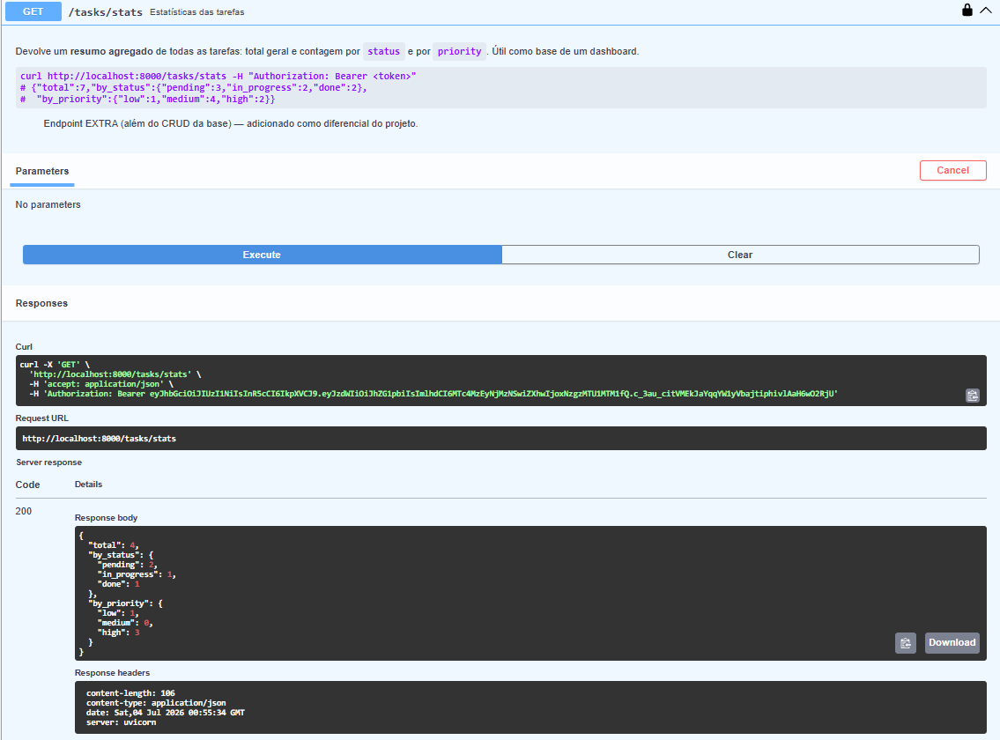

Documentação do endpoint no Swagger (descrição + schema de resposta):

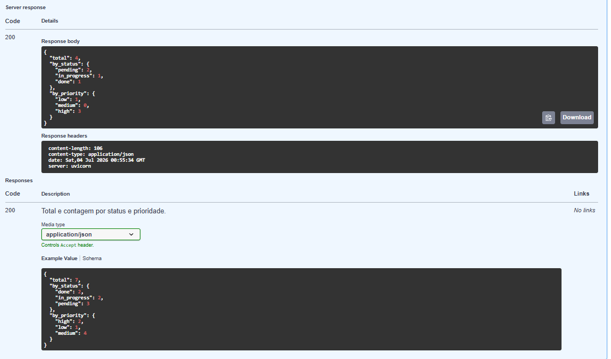

## C.5 — Eventos automáticos (`GET /events`)

Resposta **200** listando vários eventos `task.created` gerados automaticamente
a cada criação de tarefa (integra CRUD + event store):

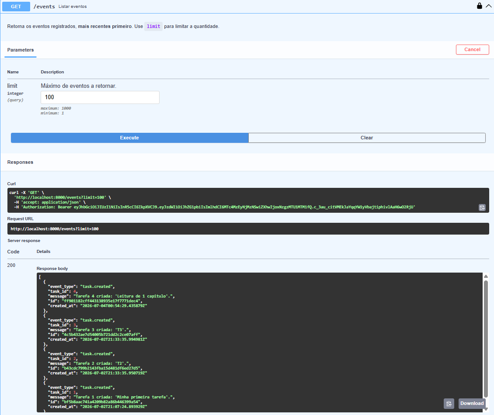

Documentação do endpoint de eventos (schema de resposta):

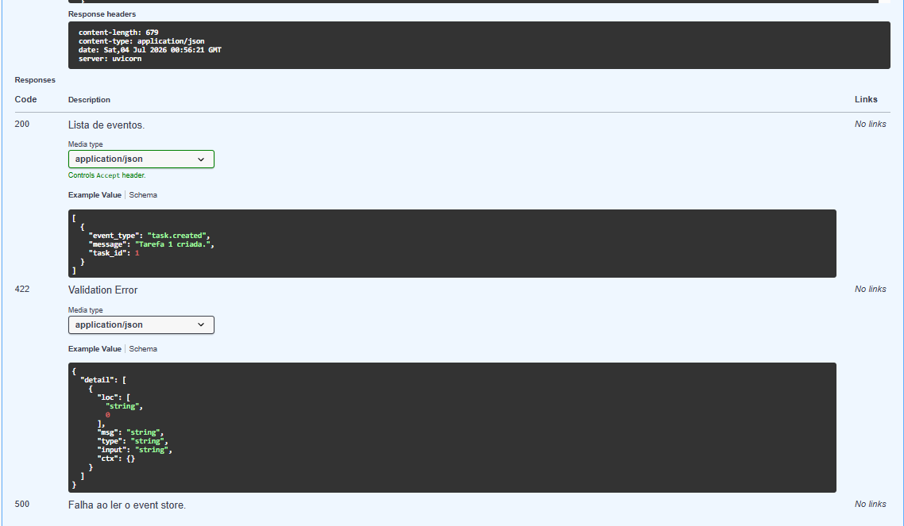


<div style="page-break-before: always;"></div>

# Anexo D — Kubernetes e Containers Docker (evidência visual)

> A aplicação **TaskFlow AI** empacotada em **container Docker** e orquestrada por
> um cluster **Kubernetes real** (Kind — Kubernetes-in-Docker), rodando localmente
> sem custo de nuvem. Detalhes em `evidencias/03-kubernetes-kind.md`.

## D.1 — Aplicação servida PELO Kubernetes (NodePort `:30080`)

O Swagger do **TaskFlow AI** respondendo pela porta `30080` — exposta pelo Service
NodePort do cluster (note a URL `localhost:30080`, diferente da porta `8000` do
Docker Compose):

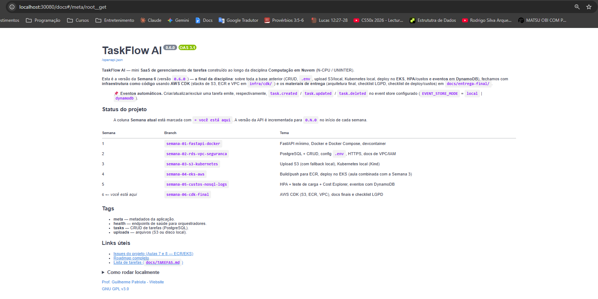

## D.2 — Kubernetes funcionando (`kubectl get pods,deployments,svc`)

Pods `Running`, Deployment `api` com **2 réplicas** (`2/2`, alta disponibilidade),
Deployment `postgres` `1/1`, e o Service `api` do tipo **NodePort** `8000:30080`:

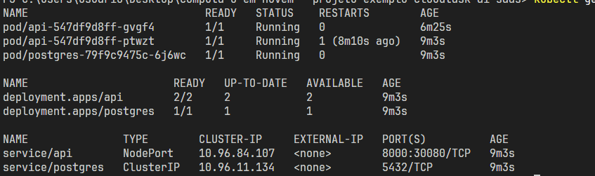

> O cluster também demonstrou **auto-healing**: ao deletar um pod da API, o
> Kubernetes recriou outro automaticamente para manter as 2 réplicas
> (log em `evidencias/03-kubernetes-kind.md`).

## D.3 — Containers Docker (`docker ps`)

Containers em execução: o nó do cluster **`cloudtask-control-plane`**
(`kindest/node`) e os containers de apoio (`cloudtask-api`, `cloudtask-db`):

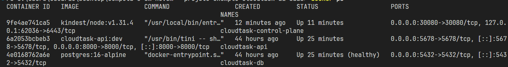


<div style="page-break-before: always;"></div>

# Anexo E — Nuvem AWS (evidência de "uso de cloud")

> Recursos criados numa conta **AWS** real (conta `7303-3524-6337`, região
> **América do Sul / São Paulo — sa-east-1**), demonstrando uso de nuvem.
> Os recursos foram **destruídos após a coleta das evidências** para não gerar
> custo (ver `deployment-checklist-preenchido.md`).

## E.1 — Amazon S3: bucket criado (privado + criptografado)

Bucket **`taskflow-ai-uploads-jlucas`** criado na região de São Paulo. É onde o
TaskFlow AI armazena os **uploads dos usuários** (endpoint `POST /uploads` com
`STORAGE_MODE=s3`). Configurado com **Block Public Access** e **criptografia
SSE-S3** (atende aos itens de segurança/LGPD):

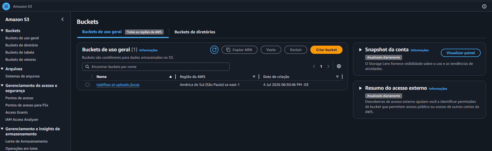

## E.2 — Amazon S3: objeto enviado com sucesso

Upload real de um arquivo (`cloud-system.png`, 1.1 MB) para o bucket — **"Upload
bem-sucedido"**. Comprova o S3 armazenando objetos de verdade na nuvem:

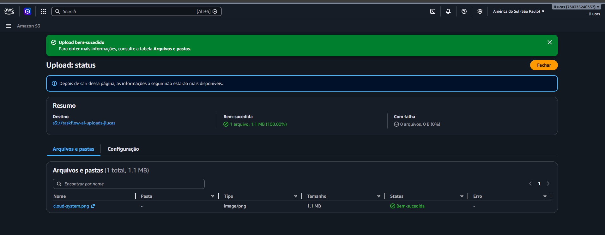

## E.3 — Deploy em cloud: aplicação rodando em Amazon EC2 ⭐

A aplicação **TaskFlow AI** foi **implantada num servidor EC2 real** (instância
`t3.micro`, Amazon Linux 2023, região São Paulo). No servidor, via Docker, subimos
a API + PostgreSQL (`docker compose ps` mostrando os containers `Up`):

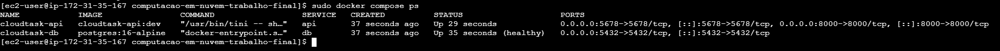

E o **Swagger do TaskFlow AI acessível pela internet** pelo **IP público da AWS**
(`http://15.229.42.56:8000/docs`) — este é o **"Deploy em cloud"**: a aplicação
não está mais só na máquina local, e sim rodando num servidor na nuvem, acessível
publicamente:

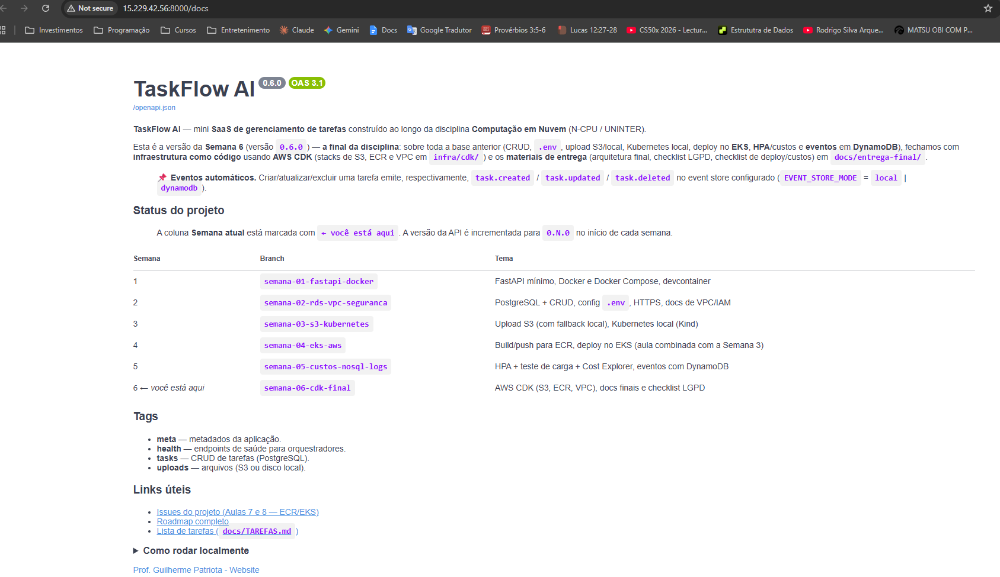

> **Passos do deploy (resumo):** instância EC2 (free tier) + security group
> liberando a porta 8000 → conexão via EC2 Instance Connect → instalação de Docker
> + git → `git clone` do repositório do GitHub → build da imagem e `docker compose up`.
> **Todos os recursos AWS foram destruídos após a coleta das evidências** (ver
> `deployment-checklist-preenchido.md`).


<div style="page-break-before: always;"></div>

# Checklist LGPD + segurança — TaskFlow AI (PREENCHIDO)

> Preenchido por **João Lucas** em 02/07/2026. Projeto executado em **modo local**
> (Docker, sem AWS). Itens específicos de nuvem são marcados como *"não se aplica
> — modo local"* com a explicação de **como seria em produção real**, mostrando
> entendimento do conceito. Baseado em `lgpd-checklist.md` (template do professor).

---

## 1. Dados pessoais — mapeamento

- [x] **Quais** dados pessoais a aplicação coleta: **praticamente nenhum**. As
      tarefas são texto livre (`title`/`description`); só haveria dado pessoal se
      o usuário digitasse um no texto. A autenticação usa **uma única conta
      administrativa** (`admin`), sem cadastro de titulares.
- [x] **Onde** cada dado é armazenado: tarefas no **PostgreSQL**; uploads no
      **disco local** (`./local_uploads`, modo local); eventos em **JSON local**
      (`./local_events/events.json`). Em produção: RDS + S3 + DynamoDB.
- [x] **Por quanto tempo / como apagar**: não há retenção automática. O titular
      apaga via `DELETE /tasks/{id}`. Sem política formal de expiração (seria
      definida em produção real).

## 2. Bases legais e finalidade (LGPD art. 6–11)

- [x] **Finalidade específica**: gerenciar tarefas (estudo/demonstração da
      disciplina). Documentada aqui e no README.
- [x] **Base legal**: projeto **didático** — a finalidade documentada cumpre o
      exercício. Em uso real, seria execução de contrato / legítimo interesse.

## 3. Segurança técnica (LGPD art. 46)

- [~] **Em trânsito**: em modo local roda em **HTTP** (`localhost`, dev). *Não se
      aplica TLS localmente.* Em produção real, o TLS termina na **borda** (Edge
      Caddy com cert ACME, ou ALB + ACM) — a API nunca administra certificado.
      Conceito coberto em `docs/conceitos/https-tls.md`.
- [~] **Em repouso**: disco local sem criptografia (dev). Em produção:
      S3 (`S3_MANAGED`), RDS (encryption at rest), DynamoDB (padrão) — todos com
      criptografia ativa.
- [x] **Segredos fora do código/git**: **verificado** — `.env` está no
      `.gitignore` e **não** é rastreado (`git ls-files` não lista `.env`); nenhuma
      chave AWS real (`AKIA…`) no repositório. A senha de demo `admin#123` é uma
      **simplificação didática** documentada (default em `config.py`); em produção
      viria de Secrets Manager / SSM e nunca seria fixa.
- [~] **Bucket S3 privado (Block Public Access)**: não se aplica (modo local). As
      stacks CDK (`infra/cdk/`) criam o bucket **privado e criptografado** —
      conceito coberto.
- [~] **Credenciais temporárias (roles)**: não se aplica localmente. Em AWS, o
      EC2/EKS usa **roles** (sem chave fixa) — ver `infra/cdk` e docs.
- [x] **Menor privilégio**: a aplicação acessa só o banco/armazenamento que
      precisa; rotas de dados exigem token JWT.

## 4. Direitos do titular (LGPD art. 18)

- [x] **Acessar** os dados: `GET /tasks` (listar) e `GET /tasks/{id}` (consultar).
- [x] **Excluir**: `DELETE /tasks/{id}` remove a tarefa. (Uploads podem ser
      removidos do armazenamento correspondente.)
- [x] **Logs sem dado sensível**: os eventos (`task.created/updated/deleted`)
      guardam só id, tipo e uma mensagem curta — **não** copiam conteúdo sensível.

## 5. Operação e incidentes

- [~] **Backups**: em modo local, os dados vivem no volume `pgdata` do Docker.
      Em produção: RDS com snapshot automático + S3 versionado (conceito coberto).
- [x] **Reação a vazamento**: rotacionar `SECRET_KEY` (invalida os JWT), trocar a
      senha admin, e — em produção — rotacionar segredos no Secrets Manager.
- [~] **Cost/uso monitorado (Budgets)**: não se aplica (sem gasto AWS). Conceito
      em `docs/conceitos/cost-explorer.md`.

## 6. Higiene de projeto

- [x] **Nenhuma conta AWS real ou segredo commitado**: verificado (seção 3).
- [x] **Recursos de teste destruídos**: não se aplica — nada foi provisionado na
      AWS (modo local). Sem recurso órfão cobrável.
- [x] **README/docs não expõem credenciais internas**: só a conta de **demo**
      documentada (`admin`/`admin#123`), intencional para a avaliação.

---

**Legenda:** `[x]` feito/verificado · `[~]` não se aplica ao modo local (explicado
como seria em produção).


<div style="page-break-before: always;"></div>

# Checklist de deploy + custos — TaskFlow AI (PREENCHIDO)

> Preenchido por **João Lucas** em 02/07/2026. Execução em **modo local** (Docker
> Compose: API FastAPI + PostgreSQL 16). **Nada foi provisionado na AWS**, então
> os blocos de nuvem (EKS/RDS/ELB/CDK) são marcados *"não se aplica"* com a
> explicação de como seriam em produção. Baseado em `deployment-checklist.md`.

---

## Antes do deploy

- [~] Credenciais AWS válidas (`aws sts get-caller-identity`): **não se aplica** —
      execução local, sem AWS.
- [~] Região correta (`us-east-1`): não se aplica (local).
- [~] Imagem no ECR: não se aplica. A imagem foi construída **localmente**
      (`docker compose build`, `cloudtask-api:dev`). Em produção iria para o ECR
      via `scripts/semana-04-ecr/build-push-ecr.sh`.
- [x] `.env` revisado: criado a partir de `.env.example`, sem placeholders quebrados.
- [x] Banco definido: **PostgreSQL 16 como container** (serviço `db` do Compose),
      ciente do trade-off vs. RDS (RDS traria backup gerenciado, HA, patch
      automático; o container é mais simples e sem custo, ideal para a demo).

## Durante (subir)

- [x] Aplicação sobe sem erro: `docker compose up --build -d` → `cloudtask-api` +
      `cloudtask-db` (este último `healthy`).
- [~] Cluster EKS `Ready` / metrics-server / `kubectl apply`: **não se aplica**
      (local). Manifests existem em `infra/k8s/aws/` para o caminho AWS.
- [x] Serviço acessível: `curl http://localhost:8000/health` → `200`;
      `/health/ready` → `{"status":"ready","db":"ok"}` (readiness checou o Postgres).

## Verificação funcional (demonstrar)

- [x] **Autenticação**: `POST /auth/login` (admin/admin#123) devolve JWT; rotas de
      dados exigem `Authorization: Bearer <token>`.
- [x] **CRUD**: criar/listar/atualizar/excluir tarefa (Swagger ou curl) — OK.
- [x] **Upload**: `POST /uploads` em **modo local** grava em `./local_uploads` e
      devolve nome + URL; download OK.
- [x] **Evento**: criar tarefa gera `task.created` (`GET /events`) — OK.
- [x] **Extra (meu)**: `GET /tasks/stats` devolve total + contagem por status e
      prioridade — OK.
- [~] **HPA** (gerar carga e ver réplicas): não se aplica (local, sem cluster).

## 🔥 Depois (destruir — OBRIGATÓRIO na nuvem)

- [~] Todos os itens (`kubectl delete`, `eksctl delete cluster`, apagar RDS/
      DynamoDB/S3, `cdk destroy`): **não se aplica** — nada foi criado na AWS,
      portanto **não há recurso cobrável para destruir**.
- [x] Ambiente local encerrado quando necessário: `docker compose down`
      (usar `down -v` zera o volume `pgdata`).

## Sweep final (tudo vazio = zero cobrança)

- [~] Comandos de varredura (EKS/EC2/ELB/NAT/EIP/RDS): **não se aplica** (local).
      Como nada foi provisionado, o resultado de todos seria vazio por definição.
- [x] **Custo do período: US$ 0,00** — execução 100% local, sem uso de AWS.

---

## Resumo de custos

| Recurso | Cobrou? | Observação |
| --- | --- | --- |
| Tudo (execução local) | **Não** | Docker na própria máquina; **US$ 0,00** |
| EKS / EC2 / RDS / ELB / S3 / DynamoDB | Não | Não provisionados — caminho AWS ficou como **conceito** |

**Legenda:** `[x]` feito · `[~]` não se aplica ao modo local (explicado).
